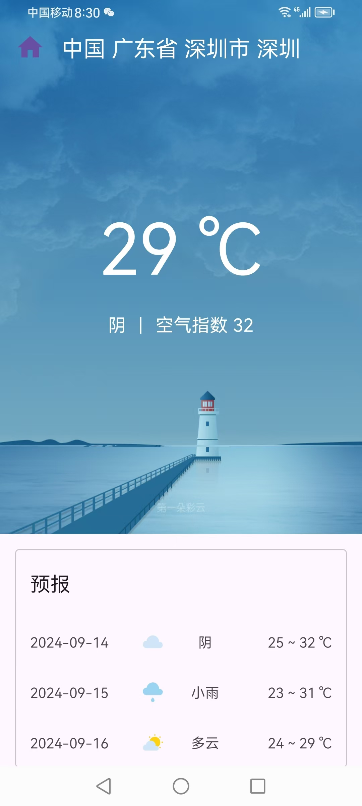
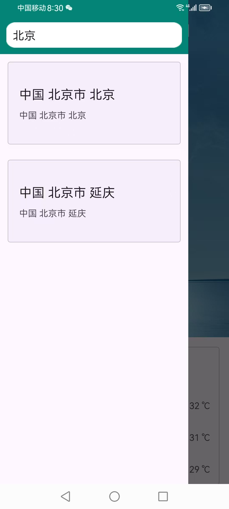
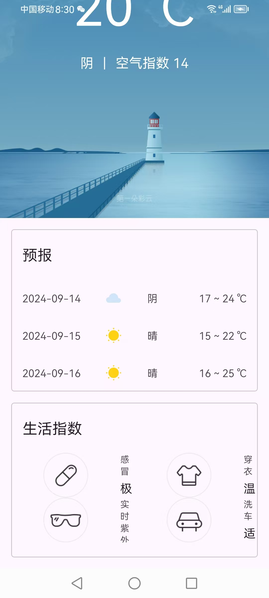

# AaaWeather

跟着《第一行代码》实现的天气 app

## 目的

练习使用 retrofit 库、MVVM 架构、recycleview、fragment、lifecycle、协程

## 环境

AGP:8.5.1

Gradle:8.7

Android Studio:Koala|2024.1.1

Android:10.0

## 一览

数据需要申请彩云天气 API 然后把 token 填入到 sunnyweatherApplication 中

首页

侧边栏切换城市

天气详细界面

